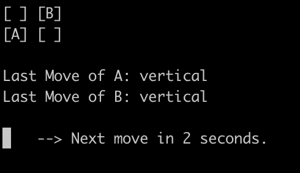

# Quantum Drone Traffic Management

A solution to a small drone traffic management problem using the Perceval software by Quandela. The program simulates two drones (`Drone A` and `Drone B`) navigating on a 2 by 2 grid, with the objective of avoiding collisions. The movement of both drones is visible in a command line interface. 

A pair of entangled photons is used as input for an optical quantum circuit. Then, the drones execute measurements on this circuit and the outcomes determine their subsequent movements, so they move either vertically or horizontally. The entanglement of the input photons ensures that the drones never collide!

## Command Line Interface



*Caption: Screenshot of the command line interface during the simulation.*

## Installation

Clone the repository to your local machine:

```bash
git clone https://github.com/your-username/quantum-drone-traffic-management.git
cd quantum-drone-traffic-management
```

## Usage

Run the simulation using the provided Python scripts:

```bash
python3 main_2by2.py
```

## Code Structure

- `QuantumDroneTrafficManagement_2by2.py`: Contains classes for the drone grid, drones, and their movements.
- `main_2by2.py`: Implements the simulation with a command line interface.

## Dependencies

- Works with Python 3.9.6
- Perceval library (`pip3 install perceval`)

## Contributing

1. Fork the repository.
2. Create a new branch: `git checkout -b feature-new-feature`.
3. Make your changes and commit them: `git commit -m 'Add new feature'`.
4. Push to the branch: `git push origin feature-new-feature`.
5. Submit a pull request.
